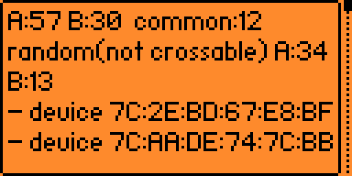
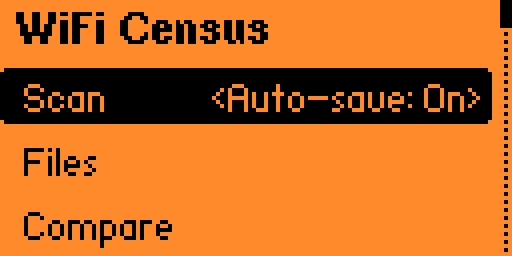
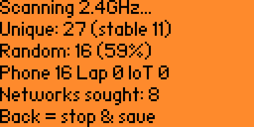
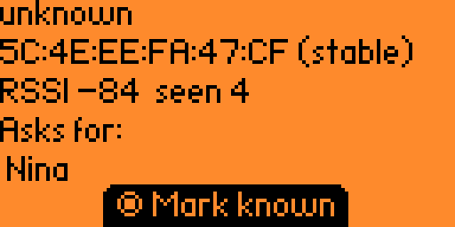
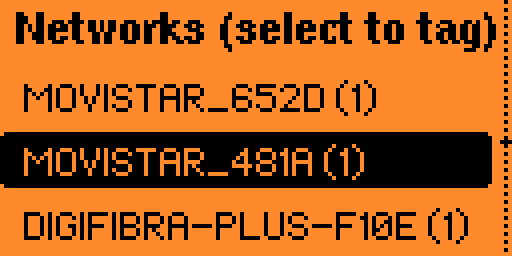
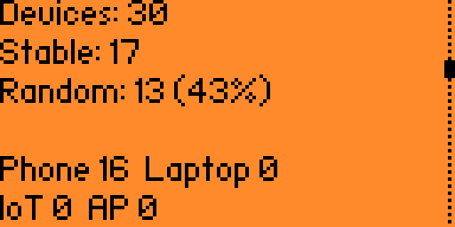
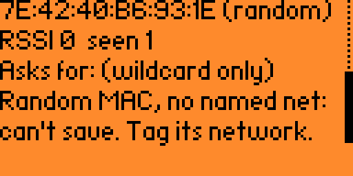

# WiFi Census

A Flipper Zero app that runs a **passive Wi-Fi device census** over an **ESP32 Marauder**
dev board on the GPIO header. It counts and types the devices around you, saves each scan to
a renamable file on the SD card, and lets you **compare captures from different locations**
to see how many devices overlap. Everything stays local on the Flipper's SD — nothing is
uploaded anywhere.

**The point of the tool — compare two locations and see who was at both:**

<p align="center"></p>

| Main menu | Live scan |
|:---:|:---:|
|  |  |
| **Device detail** | **Networks sought** |
|  |  |
| **Capture summary** | |
|  | |

## What it can and cannot tell you (please read)

Modern phones deliberately randomize their MAC address to avoid being tracked, so an honest
tool has to be clear about its limits:

- **Reliable** unique detection and A↔B matching for devices with a **stable MAC** (many IoT
  gadgets, laptops, older kit, access points) and for devices that **probe for a specific
  network by name** (a directed probe request reveals a known SSID).
- Modern phones send randomized MACs and mostly wildcard probes, so they are **counted but
  over-estimated** and **cannot be reliably matched across locations**. To recognize a
  friend's device across places, add it to the **Known devices** list — either its stable
  MAC, or use the shared-SSID trick (have them join a network whose name you control once;
  phones keep a stable MAC *per network*, so it matches in both places). A phone that only
  sends wildcard probes can't be pinned at all — the app tells you so instead of pretending:

  

- Capture is **passive only**: it reads the management frames devices broadcast in the
  clear. No deauth, no injection, no association, no decryption.
- Imported captures (see below) also carry an **IE fingerprint** and a **vendor hint from
  vendor-specific IEs** — which can name a maker (Apple / Qualcomm / Broadcom …) *even for a
  randomized MAC*. The fingerprint groups devices that look like the **same model**, not the
  same unit, so it is shown for insight but is **not** used to merge devices or cross-match
  captures (those stay on the reliable stable-MAC / probed-SSID signals) — that would
  under-count identical models or invent matches between strangers.

Use it on your own space and people who are fine with it. The probed network names it can
record are sensitive (they hint at where someone lives, works or travels), which is exactly
why nothing leaves the SD card.

## Hardware

- Flipper Zero + the **official ESP32-S2 Wi-Fi Dev Board** on the GPIO header (2.4 GHz only;
  no Bluetooth, no on-board SD — everything is stored on the Flipper's SD).
- The board must run **ESP32 Marauder v1.17.0**. This app drives Marauder's serial CLI
  (`sniffprobe` / `stopscan`) over the USART lines and parses its probe-sniff output.

UART wiring is the standard dev-board layout (Flipper pin 13 TX → ESP32 RX, pin 14 RX ←
ESP32 TX, GND/3V3 shared). Default baud is 115200 (switchable to 230400 in Settings).

### Flashing Marauder

Three ways, pick whichever is handy:

- **From the Flipper itself** — with the board on the GPIO header, use the **ESP Flasher**
  app to write Marauder to the board. No PC needed.
- **Web flasher** — Chrome/Edge WebSerial, board connected by USB, no local tooling:
  <https://flash.pingequa.com/devices/flipper-wifi-devboard-marauder>.
- **Command line** — from a machine with USB and esptool (here, the Pi).

Pin the version at **v1.17.0**; this app is written against that release's serial line
format. If you use a different build and the counts look wrong, the probe-line format is
isolated in `src/domain/wc_marauder_parse.c` and can be adjusted there.

## Using it

1. **Scan** — starts probe sniffing; the screen shows live counts (unique / stable /
   randomized / by type). Press **Back** to stop.
2. Name the capture and it is saved to the SD as `<name>.wcen` (plus a `<name>.csv` you can
   read on a PC). With **Auto-save** on — flipped with left/right on the Scan row — it names and
   saves itself instead, rotating to a new file when it fills.
3. **Summary** — open a capture and the first entry gives its numbers back: devices, stable vs
   randomized, types, networks sought, and (for captures imported from a pcap) how many phones
   are behind those randomized MACs, as a range.
4. Move to the other location and scan again.
5. **Compare** — pick two saved captures; you get how many devices each had, how many are
   common (high confidence: same stable MAC or same probed SSID), and how many randomized
   devices could not be crossed.
6. **Device detail** — from a capture's device list, select a device to see its full MAC,
   type, vendor, signal, sighting count and **the networks it is probing for**. If the device
   is identifiable (stable MAC, or it names a network), a **Mark known** button labels it.
7. **Known devices & networks** — mark rules are the randomization-resistant signal:
   - A **stable-MAC** device is remembered by its MAC.
   - A device that **probes a named network** is remembered by that SSID — so any phone asking
     for it matches, whatever random MAC it uses. You can also tag a network **directly** from
     the **Networks sought** list (select it → label it).
   - The label defaults to a generic name (`dev_…` / `net_…`) so you can just confirm.
   - In **Known**, select an entry to **Rename** or **Delete** it.
   Labeled devices and networks are highlighted in comparisons.

**How two sightings are judged to be one device.** An identical stable MAC, or a randomized MAC
naming a network that exactly one known device seeks. Both refinements below came out of
measuring real captures, not from reasoning about them:

- A network name sought by *two* devices is a place, not an identity — `DefaultSSID` was
  measured on 16 devices with distinct, certain MACs in a single capture. Such a name stops
  being usable for linking, and two stable MACs are never merged whatever they both seek.
- Phones send nameless probes as well as named ones. A device first heard on a nameless probe
  used to be recorded and never reconsidered (1982 of 2171 device creations in one capture), so
  a phone that names a network a second later was counted twice. It is now checked again when
  the name arrives: on two real captures that collapsed 17 and 82 duplicate devices, with the
  count of certain stable-MAC devices unchanged — the loss is only ever duplicates.

A randomized phone that only sends wildcard probes (no named network) can't be turned into a
durable rule — the detail screen says so instead of failing silently. Tag a network it seeks.

Files are stored under `/ext/apps_data/flipper_wifi_census/`.

## Import a pcap (no Flipper needed)

Any raw-802.11 probe-request capture (linktype 105 — what Marauder writes, also Kismet /
airodump) can be turned into a census, on the Flipper or on a laptop:

- **On a PC** — build the host tool and pipe a pcap through it:
  ```sh
  make tool
  ./wc_import capture.pcap > census.csv
  ```
  It prints the same CSV the app writes (mac, random, type, vendor, networks sought, …) and a
  one-line summary on stderr. Handy when you have the pcap but not the Flipper.
- **On the Flipper** — use **Import pcap** in the menu: a file browser opens in the app's
  folder but lets you navigate the whole SD (e.g. Marauder's own capture folder) to pick the
  `.pcap`. On-device import reads files up to 64 KB; use the PC tool for larger ones.

## Serial debug

**Settings is for options; the menu's Serial debug** starts the board and shows the raw lines
Marauder sends over UART, unparsed. Use it to see the exact probe-sniff line format (handy for
tuning what the live scan can extract, e.g. whether the network name appears in the text).

## Auto-save (rotate) for big venues

Auto-save rides on the **Scan** row itself, shown on its right as `<Auto-save: On>`; **left and
right flip it** while OK still starts the scan. It sits where the decision is actually taken,
instead of in a menu you have to remember to visit first. The choice is remembered between runs
of the app, and the Settings entry shows the same value.

With it on, a scan that fills up saves the current file and starts a fresh one automatically (`auto_YYYYMMDD_HHMM_1`, `_2`, …), instead of dropping
devices. Pressing Back saves the final chunk too. You then merge all the pieces on a PC (see
below) into one census of the whole venue. A brief moment is lost at each rotation while the
file is written.

## How long should a scan be?

Measured on our own captures (`make tool && ./wc_iefp capture.pcap` prints the table): a long
scan does not count more people, it counts the same people more times. Splitting one 822-second
capture into growing windows, the stable-MAC devices double while the randomized ones multiply
by ten — a device that does not randomize is counted once however long you listen, a phone that
rotates its MAC is counted again every few minutes.

| window | devices | stable | randomized |
|---|---|---|---|
| 60 s | 45 | 26 | 19 |
| 240 s | 247 | 52 | 195 |
| 900 s | 510 | 103 | 407 |

The inflation factor is not a constant — a crowded place also holds many phones of the same
model — but across every capture we took, a **60-second window barely inflates at all**. Short
scans, repeated, beat one long one. They also fit comfortably under the device ceiling.

## The phone count is a range, not a number

**Summary** on a stored capture shows how many phones are behind the randomized MACs, as a
range. The IE fingerprint from a pcap identifies a phone *model*, not a phone — we measured one
fingerprint shared by 51 devices, and 8-13% of stable MACs (which are certain identities) would
be wrongly merged if it were used to match. So it never merges anything. But two randomized
MACs with *different* fingerprints are certainly two phones, which puts an honest floor under
the count: `distinct fingerprints <= phones <= randomized MACs`.

The range only appears for captures imported from a pcap. A live scan reads Marauder's summary
lines, which carry no fingerprint, so nothing can be bounded — the Summary says so instead of
inventing a number.

## Combine many captures on a PC (beyond the device limit)

A single Flipper scan or merge is capped at 320 devices (its RAM). To census a huge venue,
capture it as several files and merge them all on a laptop, where there is no such cap:

```sh
make tool
./wc_merge part1.wcen part2.wcen scan.pcap ... > all.csv
./wc_merge -o all.wcen part1.wcen scan.pcap ...   # also writes a capture
```

`wc_merge` deduplicates across every file (a device seen in two of them is counted once) and
accepts `.wcen` captures and `.pcap` files mixed, producing one CSV of the whole venue —
thousands of devices if needed.

Two merged censuses are also too big for the Flipper to compare — it cannot even open a file
of more than 320 devices — so the crossing has a host tool of its own:

```sh
./wc_compare monday.wcen friday.wcen > common.csv
```

It prints the matched devices as CSV on stdout and the summary on stderr: how many devices each
side holds, how many are in both, and split by why they matched (identical stable MAC, or a
shared named network). The randomized devices that can never be crossed are reported too, so
the intersection is read against the crossable part and not against everyone.

`-o` makes both tools write a `.wcen` as well as the CSV, and that capture merges and compares
again like any other. Without it the PC side was a dead end: CSV is the one format nothing reads
back, so merges could not be chained and a census built on a laptop could never come home.

| tool | takes | gives |
|---|---|---|
| `wc_import` | one `.pcap` | that capture as CSV, and with `-o` a `.wcen` |
| `wc_merge` | any number of `.wcen` / `.pcap` | all of them deduplicated, same two outputs |
| `wc_compare` | two `.wcen` / `.pcap` | what they have in common, as CSV |
| `wc_iefp` | one `.pcap` | whether the IE fingerprint discriminates, and the duration table |

A `.wcen` built this way can hold far more than the Flipper's 320: it opens on a laptop, and on
the device the app says how many devices it holds and that it is too large, rather than claiming
the file is unreadable.

## Building

Host-side domain logic is plain C and unit-tested with gcc; `furi` is confined to the
adapters and UI. The `.fap` is built with `ufbt` against the **stable** firmware SDK.

```sh
make test          # host unit tests (domain + application, in-memory fakes)
make linter        # cppcheck
make format-check  # clang-format --dry-run --Werror over all sources
ufbt               # build the .fap (writes dist/flipper_wifi_census.fap)
ufbt launch        # build, install and run on a connected Flipper
```

## Architecture

Hexagonal. `domain/` is pure C (observation model, device signature, dedup/census, capture
codec + CSV, comparison, known-device rules, the Marauder line parser) and is the only part
under host test. `application/` orchestrates use cases through ports. `platform/` holds the
furi adapters (serial, storage, clock) behind those ports, and `app/` + `scenes/` are the
scene-manager UI. That single boundary is what keeps the logic testable on the host.

### Vendor OUI table

Brand labelling of **stable-MAC** devices uses `src/domain/wc_oui_table.inc`, generated from the
official IEEE registry and bounded per vendor (the FAP loads into RAM, and phone makers randomize
their MAC so their OUIs rarely appear in a probe). Randomized phones show no OUI brand — their
maker/OS comes from the IE fingerprint on the **Import** path. To refresh the table:

```sh
curl -sSo oui.csv https://standards-oui.ieee.org/oui/oui.csv
python3 tools/gen_oui_table.py oui.csv > src/domain/wc_oui_table.inc
```

## License

GPL-3.0. See [LICENSE](LICENSE).
